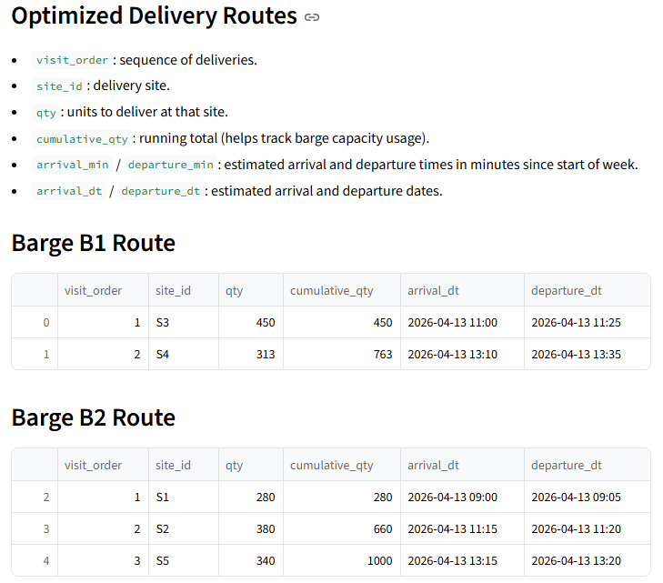

#  Barge Delivery Optimizer

Optimize weekly barge deliveries using demand forecasts and route optimization to save time, reduce costs, and improve operational efficiency.

### ⚙️ How It Works
1. **Select the week** to optimize deliveries.  
2. **Click "Run Forecast & Optimize"**.  
3. **View results**:
   - 📊 Forecasted demand per site-product
   - 🗂️ Optimized delivery sequence
   - 🗺️ Route map  

---

## 🛠️ Route Optimization with OR-Tools

This app leverages **OR-Tools**, an open-source operations research library, to solve complex delivery routing problems:

- 🚚 **Vehicle Routing Problem (VRP)**  
- 📦 **Capacitated VRP (CVRP)**  
- ⏱️ **VRP with Time Windows (CVRPTW)**  

**In this app:**

- Each barge has a **maximum capacity** and **working hours**  
- Sites have **demand, service times, and time windows**  
- The optimizer computes a route that:
  - Minimizes total travel and service time
  - Respects barge capacities and site time constraints
  - Ensures the barge **starts and ends at the depot (PORT0)**

---

## 📈 Demand Forecasting with ARIMA & Exponential Smoothing (ETS)

Forecast weekly demand per site-product using two complementary models:

### 🔹 ARIMA
- Captures **trends and autocorrelations** in historical sales data  
- Handles **non-stationary series**  
- Anticipates future demand patterns

### 🔹 Exponential Smoothing (ETS)
- Models **level, trend, and seasonal components**  
- Smooths fluctuations for stable forecasts  
- Adjusts for **weekly demand cycles**

**App workflow:**
- Aggregate daily sales into **weekly totals**  
- Forecast each site-product with **both ARIMA and ETS**  
- Use a **holdout period** to select the best-performing model  

---

## ⚡ Setup and Run

1. **Create a Python virtual environment**:
```bash
python -m venv venv
```


2. **Activate and install dependencies**:
```
# Windows
venv\Scripts\activate
# macOS/Linux
source venv/bin/activate

python -m pip install -r requirements.txt
```

3. **Run the Streamlit app**:
```
streamlit run app.py
```

---

  
  
  

---

## 📜 License  
This project is licensed under the [MIT License](LICENSE.md), granting permission for commercial and non-commercial use with proper attribution.

---

## Disclaimer  
This workshop and demo application are intended for educational and demonstration purposes. It is provided "as-is" without any warranties, and users assume all responsibility for its use.